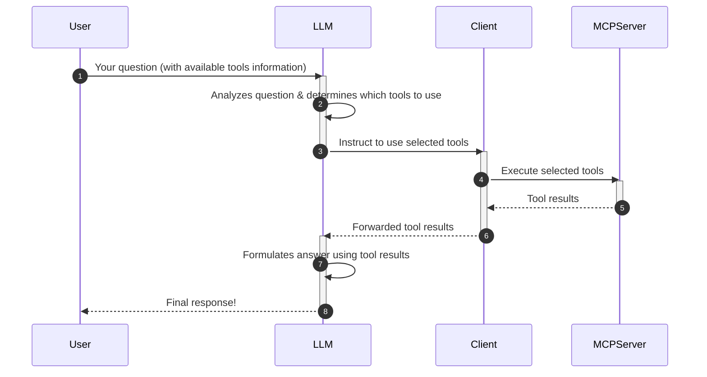
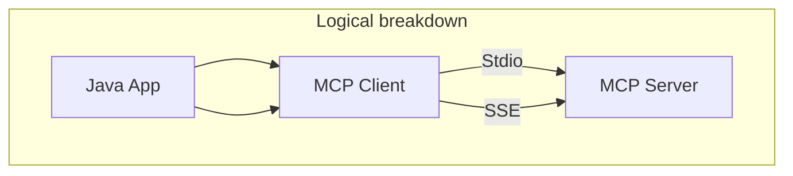
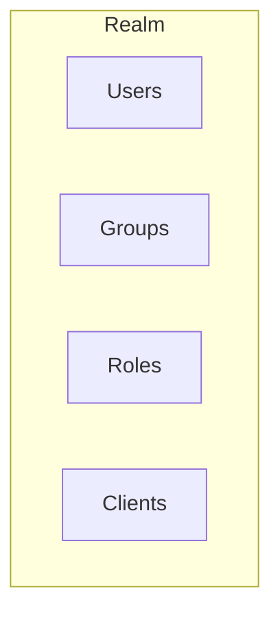
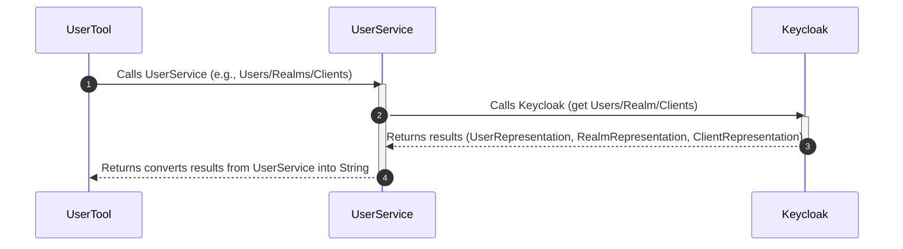

Recently I wrote an article about "[Adoption of the Model Context Protocol Within the Java Ecosystem](https://www.infoq.com/news/2025/05/mcp-within-java-ecosystem/)". Now it was also time to start experimenting with writing an MCP Server myself (well maybe not the [first time](https://youtu.be/LCzeb61bU9A?si=7mwaSEcaoEWuUB2z&t=5255)).
Certainly I don't want to be left out of all the cool things being demonstrated by the community. The goal for me is to learn, and creating perhaps a more practical example. In this post I am going to choose [Keycloak](https://www.keycloak.org/), and write an experimental MCP server implementation for keycloak. The post is also to spark interest around this topic. Will it be useful to have an MCP server for Keycloak? 


What is **Model Context Protocol?** a standard [introduced by Anthropic in November 2024](https://www.anthropic.com/news/model-context-protocol). The intention of [MCP](https://modelcontextprotocol.io/introduction) is to have a standard that helps the community write and consume Tools, Prompts and Resources. Imagine you start writing a tool for a tool like Slack and I also start to write a Tool for Slack. lo and behold we both have our own implementations, but then Slack comes out with its own Tools as well. Now we have a little problem at this point, one that there is no standard way to communicate with these Tools and secondly if Slack or GitHub were owning the piece of creating and exposing Tools for their services, makes your's and my life easier. Thats exactly the usecase I see MCP is very helpful for. 



**Explanation** 
- User sends a query/question the LLM. 
- LLM analyzes the question and decides if a Tool needs to be invoked. 
- LLM then instructs the client to execute tools. 
- The client executes the Tools on the MCP server. 
- Client then returns the results back to the LLM. 
- And the LLM formulates the results for the User.


While that was just a base example. The reality is that MCP also supports `Prompts` and `Resources`. Its also important to state that MCP in generic terms does not really bring new features, but focuses on a Standard. And since its advent, we have multiple MCP servers and implementations in frameworks at our disposal. Like Quarkus, Spring AI, MCP SDK etc. 

> MCP enables us to develop agents and complex workflows with LLMs by providing e.g. a selection of pre-built integrations and flexibility to switch between LLMs.

### Stdio vs SSE
A crucial distinction should be made between local development using Standard IO (where server and client are on the same machine) or building CLI apps versus remote development using Server-Sent Events (SSE) over HTTP (allowing servers to be deployed elsewhere and accessed via API). The latter should be highlighted as the most practical for real-world, multi-application use though. Another important thing to note is that the MCP Server communicates via the [JSON-RPC](https://www.jsonrpc.org/specification)

>JSON-RPC is a stateless, light-weight remote procedure call (RPC) protocol. Primarily this specification defines several data structures and the rules around their processing. It is transport agnostic in that the concepts can be used within the same process, over sockets, over http, or in many various message passing environments




### Keycloak
If you arent familiar with [Keycloak](https://keycloak.org); its an opensource identity and access management software. Current version is 26, its used alot already in the wild. It provides single sign on capabitlity with OAuth/OIDC, AD, LDAP and SAML v2 as well. If you aren't very familiar with Keycloak, I have also written a small self-paced [Keycloak tutorial](https://shaaf.dev/keycloak-tutorial) that goes through all the basics and some advance configs too. 

Lets get started. Create a project from the `quarkus cli` or via `code.quarkus.io`. 

In my example I use the stdio. This means a CLI based standard-input-output extension.

Add the `stdio` Quarkus extension in the pom.xml

```xml
        <dependency>
            <groupId>io.quarkiverse.mcp</groupId>
            <artifactId>quarkus-mcp-server-stdio</artifactId>
            <version>1.0.0.Alpha5</version>
        </dependency>
```

Great. One interesting fact that Keycloak is also built using Quarkus. Initially its was based on Wildfly, however about 2 years ago the team moved the entire thing to Quarkus. Keycloak Admin CLI a great tool for adminstration of Keycloak as the name suggests uses REST API. I will use that for this project. Lets add that to pom.xml as well.

```xml
        <dependency>
            <groupId>io.quarkus</groupId>
            <artifactId>quarkus-keycloak-admin-rest-client</artifactId>
        </dependency>
```

Okay, so that should setup the basics for getting started. 

Since I am starting this from scratch. Time to write the first service. I am going to write a `UserService` which will call CRUD operations via the Keycloak Admin client for `Users` in a realm.

## What is a Realm
A realm is the logical namespace for all configurations, options, for a given group or applications or services. A realm secures and manages security metadata for a set of users, applications, and registered identity brokers, clients etc. Users can be created within a specific realm within the Administration console. Roles (permission types) can be defined at the realm level and you can also set up user role mappings to assign these permissions to specific users. A user belongs to and logs into a realm. Realms are isolated from one another and can only manage and authenticate the users that they control.




## UserService for Keycloak
Lets start with writing a service class to access Keycloak. 

```java
@ApplicationScoped // [1]
public class UserService {
    
    @Inject 
    Keycloak keycloak; // [2]

}
```
The service starts when the application starts `@ApplicationScoped`. I am also injecting the `import org.keycloak.admin.client.Keycloak` client to call the admin API on Keycloak. 

The following `getUsers` method takes a realm as input. This means I am forcing the user to specify a realm. As thier can by multiple realms in a keycloak installation. Once the `realm` parameter is recieved, I can then call the `user().list()` to get all the users in the realm. 

```java
    public List<UserRepresentation> getUsers(String realm) {
        return keycloak.realm(realm).users().list();

    }
```

For the `addUser` method I want User creation parameters and the realm. This way when the Tool call is made, I want to make sure that the context is the realm. For example a user might ask to get Users from two realms and then add user to one of them. 

```java
    public String addUser(String realm, String username, String firstName, String lastName, String email, String password) {
        UserRepresentation user = new UserRepresentation(); // setting up User fields [1]
        user.setFirstName(firstName);
        user.setLastName(lastName);
        user.setUsername(username);
        user.setEnabled(true);
        user.setEmail(email);

        CredentialRepresentation credential = new CredentialRepresentation(); // Add the password [2]
        credential.setType(CredentialRepresentation.PASSWORD);
        credential.setValue(password);
        credential.setTemporary(false);
        user.setCredentials(List.of(credential));
        
        Response response = keycloak.realm(realm).users().create(user); // Send creation request [3]
        if (response.getStatus() == Response.Status.CREATED.getStatusCode()) {
            return "Successfully created user: " + username;
        } else {
            Log.error("Failed to create user. Status: " + response.getStatus());
            response.close();
            return "Error creating user: "+" "+username;
        }
    }
```

- **1** - the `UserRepresentation` class is part of the Admin REST API and is used to represent a user in the context of managing users within a Keycloak realm. This class encapsulates various attributes and properties associated with a user, allowing administrators to create, update, and retrieve user information programmatically
- **2** - the `CredentialRepresentation` class is used to represent the credentials associated with a user account. This class is part of the Keycloak Admin REST API and is essential for managing user authentication methods, such as passwords, OTP (One-Time Password), and other credential types
- **3** - finally I send the create user request to Keycloak. There is some more error handling underneath this section to ensure that when a Tool is called, I can return the right status.

Similarly I also implement the following two functions, to delete a user and get a user by its name.
```java
public String deleteUser(String realm, String username)
public UserRepresentation getUserByUsername(String realm, String username)
```

Full code listing of the `UserService` available here on [github](https://github.com/sshaaf/keycloak-mcp-server/blob/main/src/main/java/dev/shaaf/experimental/service/UserService.java)


Two more operational things I will need to do, inorder for the above to run successfully. 

Add the following line to the properties file. This means I am running our local keycloak instance on port 8081.
```properties
quarkus.keycloak.admin-client.server-url=http://localhost:8081
```

### Keycloak dev-mode via docker-compose

There is also a docker-compose.yaml file for keycloak that will spin it up locally. All it does is start keycloak in dev mode, and expose port `8081`. Currently I am running this file with podman.

```yaml
services:
  keycloak:
    image: quay.io/keycloak/keycloak:latest
    container_name: keycloak
    environment:
      - KEYCLOAK_ADMIN=admin
      - KEYCLOAK_ADMIN_PASSWORD=admin
    ports:
      - "8081:8080"
    command: >
      start-dev
    volumes:
      - keycloak_data:/opt/keycloak/data
    restart: unless-stopped

volumes:
  keycloak_data:
```

To run the above file `docker-compose up` 


## Creating the UserTool

A Tool is a component that enhances the capabilities of LLMs by enabling them to perform specific actions and interact with external systems. This could be APIs, databases, internal systems etc. Thats exactly what I will do here, build Tools for keycloak. We create the following flow, where UserTool will call the UserService that in turn calls Keycloak for the operations. I have already created UserService. Now its time to create UserTool. 




In the following `UserTool` class I inject UserService and also the ObjectMapper. I am using `com.fasterxml.jackson.databind.ObjectMapper` to transform some of the results to String e.g. List.

```java
public class UserTool {

    @Inject
    UserService userService;

    @Inject
    ObjectMapper mapper;
}
``` 

Next up, Lets create a Tool that the MCP server can expose

```java
    @Tool(description = "Get all users from a keycloak realm") // [1]
    String getUsers(@ToolArg(description = "A String denoting the name of the realm where the users reside") String realm) { // [2]
        try {
            return mapper.writeValueAsString(userService.getUsers(realm)); // [3]
        } catch (Exception e) {
            throw new ToolCallException("Failed to get users from realm");
        }
    }
```
- **1** - @Tool(description = "Get all users from a keycloak realm")
    - `@Tool`: signifies that the getUsers method is recognized as a callable function or tool by the LLM.
    - `description` describes the what this Tool does, e.g. get all users. LLM can call this Tool when a request is made to get all users from keycloak. 
>Since LLM can understand natural language, all questions leading to a context to get users from keycloak should *theoratically call this Tool. Also note that if I add to much detail that mixes up with other tool descriptions the LLM is likely not going to call the *desired* Tool and eventualy hallucinate. Care should be taken on how the descriptions are written. I suggest to be concise and direct leaving ambuguity and overlaps.
- **2** - ToolArg specifes to the LLM that an argument is required for this Tool. In my case it has to be a realm. So if a user just say get all users. The LLM should come back and ask which realm. Like mentioned above, be mindful about the description parameter.  
- **3** - Finally once the result comes back from the `UserService`, in this case a List. I am using the ObjectMapper to convert it to String, so the LLM can understand the response. I have tried this with Jsonb as well, it works pretty okay.  


```java
    @Tool(description = "Create a new user in keycloak realm with the following mandatory fields realm, username, firstName, lastName, email, password")  // [1]
    String addUser(@ToolArg(description = "A String denoting the name of the realm where the user resides") String realm,  // [2]
                   @ToolArg(description = "A String denoting the username of the user to be created") String username,
                   @ToolArg(description = "A String denoting the first name of the user to be created") String firstName,
                   @ToolArg(description = "A String denoting the last name of the user to be created") String lastName,
                   @ToolArg(description = "A String denoting the email of the user to be created") String email,
                   @ToolArg(description = "A String denoting the password of the user to be created") String password) {
        return userService.addUser(realm, username, firstName, lastName, email, password);  // [3]
    }
```
- **1** - Since this is a create method for a new user. I am specifying exacts of whats required.  
- **2** - All the different parameters required for the successful execution of this Tool. 
- **3** - And finally once the UserService returns I pass the result to the LLM for further processing.

### Packaging
We should add the following properties to the `application.properties`

```properties
quarkus.package.jar.type=uber-jar # [1]
quarkus.log.file.enable=true # [2]
quarkus.log.file.path=kcadmin-quarkus.log # [3]
```
- **1** - tells Quarkus to create an uber jar. An Uberjar, also known as a "fat jar" or "shadow jar," is a type of Java Archive (JAR) file that includes all the dependencies and resources required to run a Java application.
- **2** - I would also want a log file so I can understand whats going on.  
- **3** - The address and name of the log file. 


```bash
mvn clean package
```
Full sourcode of the application can be found [here](https://github.com/sshaaf/keycloak-mcp-server). Incase you would just like to run it :) 

### Running with Goose
>a local, extensible, open source AI agent that automates engineering tasks

[Goose by block](https://github.com/block/goose) provides a cli tool that has the capability to add MCP as extensions. Use `goose configure` to add the LLM config and API key. 

Once the cli is conffigured, I can now add the packaged MCP server by adding it as as an extension.

```bash
 goose session --with-extension="java -jar target/keycloak-mcp-server-1.0.0-SNAPSHOT-runner.jar" 
```

Here are some examples on questions one can ask?
```bash
( O)> can I create a new user in keycloak?
Yes, you can create a new user in Keycloak. To do this, you'll need to provide the following information about the user:

- **Realm**: The name of the realm where the user will reside.
- **Username**: The username for the new user.
- **First Name**: The first name of the user.
- **Last Name**: The last name of the user.
- **Email**: The email address of the user.
- **Password**: The password for the user's account.

You can provide these details, and I can assist you with creating the user.


----
( O)> list all users in all realms
Here are the users in the "quarkus" realm:

1. **admin**
   - ID: `af134cab-f41c-4675-b141-205f975db679`

2. **alice**
   - ID: `eb4123a3-b722-4798-9af5-8957f823657a`

3. **jdoe**
   - ID: `1eed6a8e-a853-4597-b4c6-c4c2533546a0`

----
( O)> can you delete user sshaaf from realm quarkus

```

Okay, so that sums it up. hope you enjoyed it and ready to write your first MCP server implementation as well. 

## Summary
The article explores creating a practical Model Context Protocol (MCP) server for Keycloak, aiming to learn and demonstrate its potential for AI-powered administration. MCP, standardizes how LLMs interact with external tools, prompts, and resources, addressing the issue of fragmented custom integrations. The article details building this experimental Keycloak MCP server using Quarkus and the Keycloak Admin REST client, focusing on user management operations within specified realms. It provides code snippets for a UserService and an MCP UserTool, explaining how to define tools and their arguments for LLM consumption via Stdio. Finally, the article shows how to package the Quarkus application and run it with "Goose," an AI agent CLI, to interact with Keycloak using natural language queries.


## Resources
- Goose - https://github.com/block/goose
- MCP - https://modelcontextprotocol.io/docs/concepts/tools
- Keycloak MCP Server - example https://github.com/sshaaf/keycloak-mcp-server
- MCP and calling your REST APIs - https://github.com/learnj-ai/llm-jakarta/tree/workshop/step-09-mcp
- Quarkus - https://quarkus.io/blog/mcp-server/
- Creating MCP Server with Quarkus - https://iocanel.com/2025/03/creating-an-mcp-server-with-quarkus-and-backstage/
