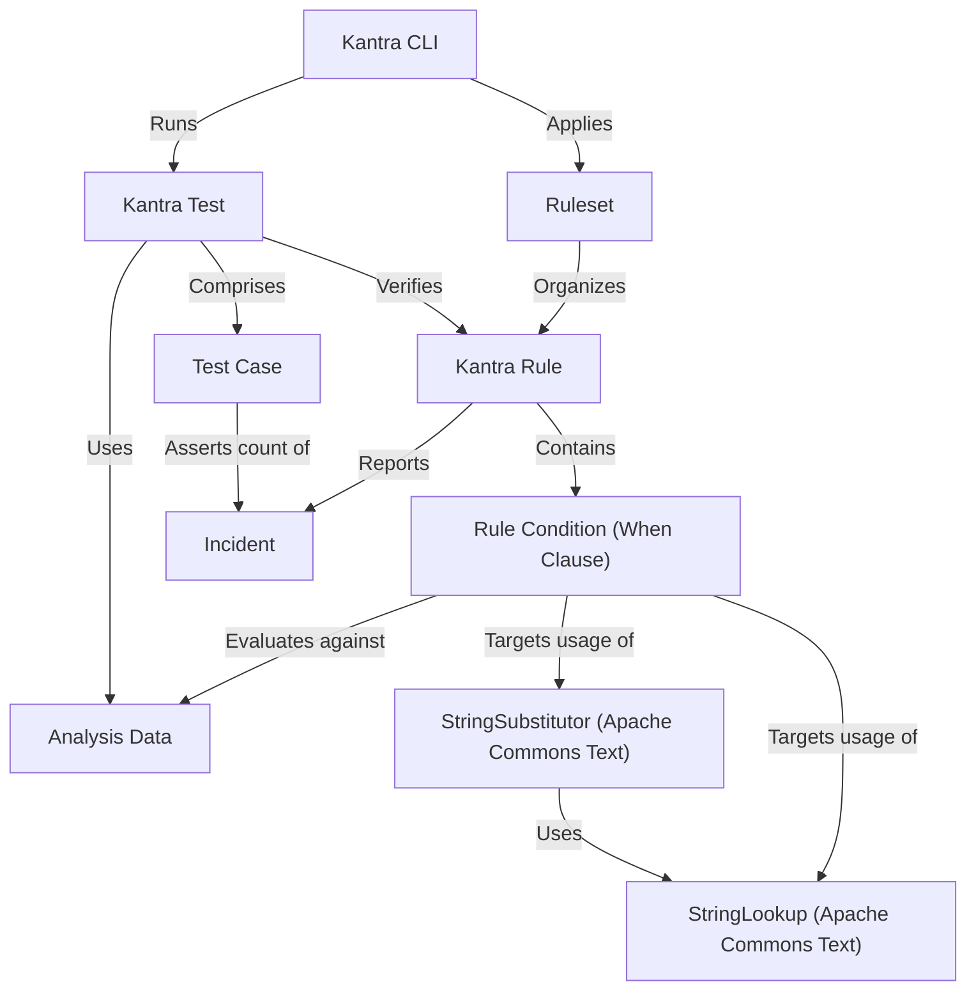
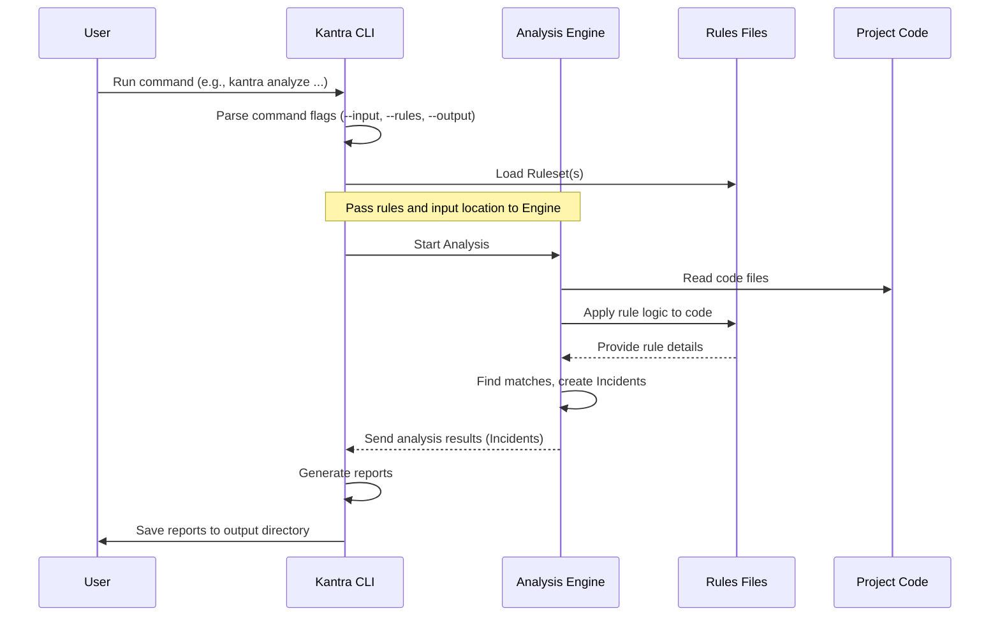

Konveyor Kantra CLI is a command-line tool for analyzing and transforming application source code to aid modernization and migration. It performs static code analysis to detect issues. Kantra can also extract metadata, generate deployment assets (e.g., Kubernetes manifests), and runs via containers or natively. It supports multiple languages e.g. Java, Go, .Net and Node.js and integrates with CI/CD pipelines. Kantra is the foundation for automated, LLM-powered app modernization workflows like _[Konveyor AI (Kai)](https://konveyor.io/components/kai/)_.

Kantra, comes with pre-built 2400+ rules for the Java domain. It covers stardard usecases like migrations from one JDK version to another, Spring to Spring, JBoss to Quarkus and so on. We will explore all of them in this blog series. To start using Kantra and run your custom rules, you need a way to tell it what to do. Think of it like driving a car – you need controls like a steering wheel, pedals, and buttons to make it move and do what you want. For Kantra, the primary control panel is the Kantra Command Line Interface, or Kantra CLI for short.

Kantra is also bundled into the Konveyor extension for VSCode, however in this blog we explore the CLI version. The Kantra CLI is a program you run from your terminal or command prompt. It's the main tool you'll use to:

### Start analyzing your project's code.
Tell Kantra which rules to use during analysis.
Generate reports that show the results of the analysis.
Run tests for your custom rules to make sure they work correctly.
In simple terms, the CLI is how you talk to the Kantra analysis engine.

### Installation
1. Download kantra [here](https://github.com/konveyor/kantra/releases)
2. Extract the archive

3. Rename Kantra cli and move it to PATH. (e.g)
```bash
 mv darwin-kantra $HOME/bin/kantra
```

4. Add all the files from the extracted folder into `.kantra` 
```bash
 cd kantra.darwin.arm64/
 mv * $HOME/.kantra
```

>* NOTE: Mac user will likely need to run the following command before running the cli.
`sudo xattr -dr com.apple.quarantine kantra`

The most common thing you'll do with the Kantra CLI is run an analysis on your code. This is how you discover potential issues based on the rules you provide.

```bash
kantra analyze --input=tests/data/ssti-test-project --output=output --overwrite  --target openjdk17
 --rules rules
``` 

This blog provides examples and tests for creating custom analysis rules using the Kantra tool. It focuses on identifying potentially vulnerable usage patterns of the Apache Commons Text StringSubstitutor library [reported in 2022](https://www.infoq.com/news/2022/11/apache-commons-vulnerability/), Although this vulnerability has been fixed this is a mere demonstaration of how Kantra works. For example demonstrating how Kantra rules can scan source code and configuration files to find specific security issues (like SSTI) and how Kantra tests can verify that these rules correctly detect or ignore patterns in example analysis data.

Source code for this example can be found here on [git](https://github.com/sshaaf/kantra-examples)

## Visual Overview


#### Use Case: Analyzing Your Project

The most common thing you'll do with the Kantra CLI is run an analysis on your code. This is how you discover potential issues based on the rules you provide.

Let's look at an example command:

```bash
kantra analyze --input=tests/data/ssti-test-project --output=output --overwrite  --target openjdk17 --rules rules
```

This command tells Kantra to perform an `analyze` action. Let's break down what the different parts (called "flags" or "arguments") mean:

*   `kantra analyze`: This is the main command, telling Kantra to start an analysis job.
*   `--input=tests/data/ssti-test-project`: This flag tells Kantra *where* to find the code you want to analyze. In this case, it's pointing to a specific example project directory.
*   `--output=output`: This flag tells Kantra *where* to save the results of the analysis (the reports). Here, it will create a folder named `output`.
*   `--overwrite`: This flag is useful if you've run an analysis before. It tells Kantra to replace any existing output files in the specified `--output` directory.
*   `--target openjdk17`: This flag specifies the *target* environment you are migrating *to*. Kantra can use this information to tailor its analysis based on the destination platform or technology.
*   `--rules rules`: This flag is very important! It tells Kantra *where* to find the **rules** to use for the analysis. In this example, it's pointing to a directory named `rules`. We will learn much more about [Ruleset](02_ruleset_.md)s in the next blog.

When you run this command, Kantra will read the code in `--input`, apply the logic defined in the `--rules`, and generate reports detailing any findings in the `--output` directory.

The output from the analyzer command should look like follow:
```bash
INFO[0000] 
 --run-local set. running analysis in containerless mode 
INFO[0000] running source analysis                      
INFO[0000] creating provider config                     
INFO[0000] setting provider from provider config         provider=java
INFO[0000] setting provider from provider config         provider=builtin
INFO[0000] parsing rules for analysis                    rules=rules
INFO[0000] parsing rules for analysis                    rules=/Users/sshaaf/.kantra/rulesets
INFO[0001] starting provider                             provider=builtin
INFO[0001] starting provider                             provider=java
INFO[0003] running depencency analysis                  
INFO[0003] evaluating rules for violations. see analysis.log for more info 
INFO[0008] writing analysis results to output            output=/Users/...security/ssti/output
INFO[0008] generating static report                     
INFO[0008] Static report created. Access it at this URL:  URL="file:///Users/...security/ssti/output/static-report/index.html"
``` 

Kantra can create output in multiple formats. Here I am just using the default html version which should look something like this:


Click on the links to get more information about the incidents and the offending lines of code. Following is how it should look, clearly showing the violation and the line of code. 


If you click on the file it should also show the code and the exact offending line.


This screen shot is from one of the standard rules provided by Kantra. While developing custom rules one can also write test cases. Let's take a look at that as well.

#### Use Case: Running Rule Tests

Another crucial use of the Kantra CLI, especially when developing custom rules, is running tests. Kantra has a built-in testing framework. The `kantra-examples` project includes tests for the example rules.

The command to run tests, as shown in the `README.md`, looks like this:

```bash
cd ssti/tests
kantra test .
```

*   `cd ssti/tests`: This first part is just changing your current directory in the terminal to where the test files for the `ssti` example are located.
*   `kantra test .`: This is the Kantra command. It tells Kantra to perform a `test` action. The `.` means "test everything in the current directory".

Running this command executes the rule tests defined in that directory. This is super helpful for verifying that your custom rules correctly identify issues in example code snippets designed specifically for testing. 

### Under the Hood: How the CLI Works (Simply)

You might wonder what happens when you type a command like `kantra analyze ...` and press Enter. At a high level, it's a simple process:

1.  **You** run the command in your terminal.
2.  The **Kantra CLI** program starts.
3.  The CLI reads the command you typed, including all the flags (`--input`, `--rules`, etc.).
4.  Based on the command (like `analyze`), the CLI knows what to do next.
5.  For `analyze`, the CLI loads the **Ruleset**s from the location you specified with `--rules`.
6.  The CLI then hands over control (and the loaded rules and input location) to the main **Analysis Engine** within Kantra.
7.  The Analysis Engine reads your **Project Code** (from `--input`).
8.  The Analysis Engine uses the logic from the **Rules** to scan your code for patterns or issues.
9.  If it finds something matching a rule, it creates a record of it (an **Incident**, which we'll cover in [Incident](08_incident_.md)).
10. After scanning everything, the Analysis Engine gives the results back to the CLI.
11. The CLI then formats these results into reports and saves them to the `--output` location you specified.

Here's a very basic sequence diagram to visualize this flow:



As you can see, the Kantra CLI acts as the orchestrator. It takes your instructions, sets up the necessary inputs (rules, code location), triggers the core analysis process, and handles the output.

### Conclusion

The Kantra CLI is your essential tool for interacting with Kantra. You use it to initiate code analysis, specify which rules to apply, control input and output, and run tests for your custom rules. By understanding the basic `analyze` and `test` commands and their common flags, you have the foundation to start using Kantra on your own projects.

In the next blog, we'll dive deeper into the concept mentioned frequently: the **Ruleset**. You'll learn how rules are organized and how Kantra finds and uses them.