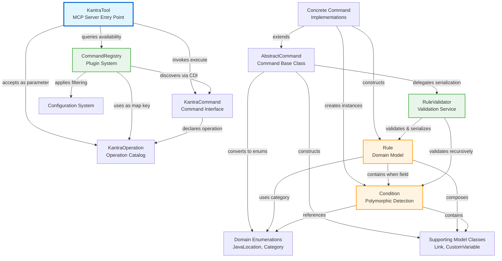

Sometime around last year, I started a project ([Waver](https://github.com/sshaaf/waver)) that would generate tutorials from a codebase. Easy to follow tutorials in pure markdown + mermaid diagrams, so any person could be onboarded with ease, projects could add it to project pipelines etc. The idea was simple, I chose Langchain4J to do this. If this wasnt amusing enough, I also ended up creating [JGraphlet](https://shaaf.dev/post/2025-08-25-think-in-graphs-not-just-chains-jgraphlet-for-taskpipelines/#undefined) while trying to optimize the performance of LLM communication. 

There are certain advantages when this is done in pure Java, the obvious ones are control and optimizations such as performance. By that point it can also become highly opinionated. Anyways why am I writing this post today. Lets start with a code example from my Java project

```java
package dev.shaaf.waver.cli;

import dev.langchain4j.model.chat.ChatModel;
import dev.shaaf.jgraphlet.TaskPipeline;
import dev.shaaf.waver.llm.config.AppConfig;
import dev.shaaf.waver.llm.config.ModelProviderFactory;
import dev.shaaf.waver.llm.tutorial.task.*;

import java.nio.file.Path;
import java.nio.file.Paths;
import java.util.logging.Logger;

public class TutorialGenerator {

    private static final Logger logger = Logger.getLogger(TutorialGenerator.class.getName());


    public static void generate(AppConfig appConfig) {

        ChatModel chatModel = ModelProviderFactory.buildChatModel(appConfig.llmProvider(), appConfig.apiKey());
        Path outputDir = Paths.get(appConfig.absoluteOutputPath() + "/" + appConfig.projectName());

        logger.info("🚀 Starting Tutorial Generation for: " + appConfig.inputPath());
        try (TaskPipeline tasksPipeLine = new TaskPipeline()) {
            tasksPipeLine.add("Code-crawler", new CodeCrawlerTask())
                    .then("Identify-abstraction", new IdentifyAbstractionsTask(chatModel, appConfig.projectName()))
                    .then("Identify-relationships", new IdentifyRelationshipsTask(chatModel, appConfig.projectName()))
                    .then("Chapter-organizer", new ChapterOrganizerTask(chatModel))
                    .then("Technical-writer", new TechnicalWriterTask(chatModel, outputDir))
                    .then("Meta-info", new MetaInfoTask(chatModel, outputDir, appConfig.projectName(), appConfig.inputPath()));
            tasksPipeLine.run(appConfig.inputPath()).join();
            logger.info("\n✅ Tutorial generation complete! Output located at: " + outputDir);
        }

    }
}

```

All of these Tasks in the TaskPipeline above are backed by a prompt. So basically its prompt chaining. There wasnt much about `SKILLS.md` back then. Fast track to today. I have tried to take all the prompts and put them in a Skill instead. And atleast from the intial tests I am looking at its looking pretty good. For example here is a mermaid drawing generated from one of MCP servers (scribe)



### Building the SKILLS.md

Lets take a look at the basic file structure when creating a skill. 

#### File Structure

- `SKILL.md` - Main skill definition and instructions
- `package.json` - NPM package configuration
- `installer.js` - Installation script
- `bin/` - Executable commands
- `tests/` - Test files, in my case these are test projects in multiple languages so I can compare whats generated. 

The Skills file is quite large (100+ lines), here is a little snippet from the code discover phase during anaylsis.

```md
1. Determine project details:
   - If user provided path in command (e.g., `/tutorial analyze ./src`), use that
   - Otherwise ask: "What directory should I analyze?"
   - Auto-detect primary language from file extensions
   - Ask if they want to focus on specific areas (optional)

2. Find source files using Glob:
   - **Java**: `**/*.java` (exclude `**/test/**`, `**/target/**`)
   - **Python**: `**/*.py` (exclude `**/test/**`, `**/__pycache__/**`, `**/venv/**`)
   - **JavaScript/TypeScript**: `**/*.{js,ts,jsx,tsx}` (exclude `**/node_modules/**`, `**/dist/**`, `**/build/**`)
   - **Go**: `**/*.go` (exclude `**/*_test.go`, `**/vendor/**`)
   - **C#**: `**/*.cs` (exclude `**/bin/**`, `**/obj/**`)
   - **Ruby**: `**/*.rb` (exclude `**/spec/**`, `**/test/**`)
   - **Rust**: `**/*.rs` (exclude `**/target/**`)
   - **PHP**: `**/*.php` (exclude `**/vendor/**`, `**/tests/**`)

3. Handle large codebases:
   - If >50 files found, ask: "Found {N} files. Analyze all or focus on specific subdirectory?"
   - Suggest core directories: `src/main`, `lib`, `app`, etc.

4. Read discovered files with Read tool
5. Report: "Found {N} files totaling {LOC} lines of code"

```

### Quick start
```bash
npx @sshaaf/tutorial-skill install

# reload the coding agent. e.g. claude.

/tutorial build

#You can preview the files in markdown on disk. for example preview in VSCode. 
#However if you want to preview in html then use the following command.

/tutorial preview
```

#### Skill Modes
Currently the Skill is built into two modes. This is exactly what Waver also did, analyze the code base and then generte a contextual tutorial. Here I have broken down that process, so if users just want very basic documentation like the mermaid diagram above with some markdown of the analysis they can do that. Else building tutorial which is the second mode has more steps, to make in consumable and nice 😎

###### Analyze Mode (`/tutorial analyze`)
- 3-stage pipeline for quick codebase understanding
- Generates architecture diagrams with Mermaid
- **NEW**: Option to save diagrams to disk
- Time: 2-5 minutes

###### Build Mode (`/tutorial build`)
- 6-stage pipeline for comprehensive tutorial generation
- Creates multi-chapter Markdown tutorials
- Time: 10-30 minutes

#### Commands
While the above commands publish markdown onto disk, it can also be userful to preview them or even push them into github pages. Following will allow previewing locally and checking that it all works. 

###### `/tutorial preview`
- Local tutorial preview with HonKit
- **Time**: 5-30 seconds to start
- **Output**: Local docs site (usually `http://localhost:4000`)
- **Use for**: Reviewing generated docs before publishing

###### `/tutorial doctor`
- Diagnostics for local preview/runtime + docs scaffolding
- **Time**: ~10-30 seconds
- **Output**: Pass/fail checklist
- **Use for**: Verifying HonKit runtime + `book.json` before publishing

The markdown can also be pushed into github pages. Here is a [nice example](https://github.com/kborup-redhat/ovro/blob/main/.github/workflows/docs.yml) from [@Kim Borup](https://www.linkedin.com/in/kimborup/)


#### How to use it: Tutorial Generator & Analyzer

```bash
# Quick analysis
/tutorial analyze .

# With path
/tutorial analyze ./src/main/java

# Full tutorial
/tutorial build .

# With output directory
/tutorial build --output ./docs/tutorial

# Preview generated tutorial in Claude mode
/tutorial preview ./docs/tutorial

# Diagnose local preview/runtime/docs scaffolding
/tutorial doctor ./docs/tutorial

# Initialize docs files for HonKit
npx @sshaaf/tutorial-skill docs init --dir ./docs/tutorial

# Preview locally with HonKit
npx @sshaaf/tutorial-skill docs preview --dir ./docs/tutorial

# Build static site with HonKit
npx @sshaaf/tutorial-skill docs build --dir ./docs/tutorial

# Diagnose runtime/plugin setup
npx @sshaaf/tutorial-skill docs doctor --dir ./docs/tutorial
```

### The difference
SKILL works directly within Claude Code CLI - no separate tools needed, integrates into the developer workflow. No setup or installation and is pretty aware of the context. 
Waver on the other hand complete control on which models are being used, can run parallel and join tasks with its use of JGraphlet, can easily integarte into CI and batch modes for multiple projects etc. 

I am not entirely sure if there is an **either** or an **or** here, I would still prefer waver just because its a simplified CLI approach, which is pretty solid for multiple cases, however as soon as we speak about developer workflow a Skill makes a lot more sense when one is using Claude or OpenCode etc. I think there is another bit of optmization here that can be investigated where I can take the waver project and integrate it within the skill, so the skill can handover some of the work. A back an forth to take the best of the two.

The skill is live, and the journey from a standalone cli to an NPM-distributable skill is complete. Now, the real testing begins 😎😊

**View the project**: [github.com/sshaaf/tutorial-skill](https://github.com/sshaaf/tutorial-skill)

**Try it out**: `npx @sshaaf/tutorial-skill`